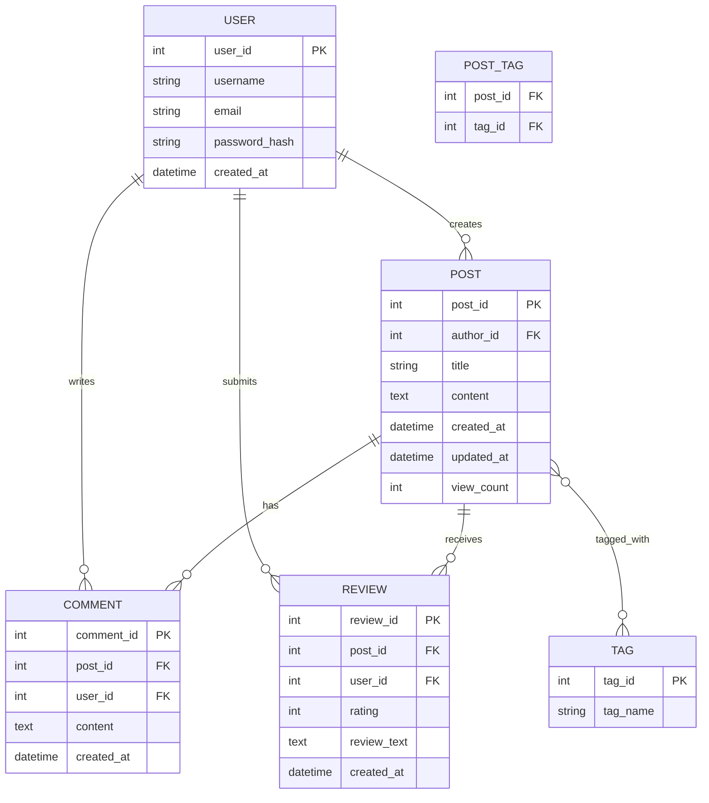

# Database Design Documentation

## Overview

The Smart Blogging Platform database is designed using PostgreSQL with a focus on normalization, performance, and data integrity. The schema supports core blogging functionality including user management, post creation, commenting, tagging, and reviews.

## Conceptual Model

### Entity-Relationship Diagram



### Entity Descriptions

**USER**: Represents registered users who can create posts, comments, and reviews.

**POST**: Blog articles created by users with title, content, and metadata.

**COMMENT**: User feedback and discussions on blog posts.

**TAG**: Categorization labels for organizing posts by topic.

**POST_TAG**: Junction table implementing many-to-many relationship between posts and tags.

**REVIEW**: User ratings and detailed reviews of blog posts (1-5 stars).

## Logical Model

### Table: users

| Column | Data Type | Constraints | Description |
|--------|-----------|-------------|-------------|
| user_id | SERIAL | PRIMARY KEY | Unique user identifier |
| username | VARCHAR(50) | NOT NULL, UNIQUE | User's display name |
| email | VARCHAR(100) | NOT NULL, UNIQUE | User's email address |
| password_hash | VARCHAR(255) | NOT NULL | Hashed password (bcrypt) |
| created_at | TIMESTAMP | DEFAULT CURRENT_TIMESTAMP | Account creation date |

**Constraints:**
- Email format validation using regex check constraint
- Username and email must be unique

### Table: posts

| Column | Data Type | Constraints | Description |
|--------|-----------|-------------|-------------|
| post_id | SERIAL | PRIMARY KEY | Unique post identifier |
| author_id | INTEGER | NOT NULL, FK → users(user_id) | Post author |
| title | VARCHAR(255) | NOT NULL | Post title |
| content | TEXT | NOT NULL | Post content (markdown supported) |
| created_at | TIMESTAMP | DEFAULT CURRENT_TIMESTAMP | Creation timestamp |
| updated_at | TIMESTAMP | DEFAULT CURRENT_TIMESTAMP | Last update timestamp |
| view_count | INTEGER | DEFAULT 0 | Number of views |

**Constraints:**
- Title minimum length: 5 characters
- Content minimum length: 10 characters
- View count must be non-negative
- Cascade delete when author is deleted

### Table: comments

| Column | Data Type | Constraints | Description |
|--------|-----------|-------------|-------------|
| comment_id | SERIAL | PRIMARY KEY | Unique comment identifier |
| post_id | INTEGER | NOT NULL, FK → posts(post_id) | Associated post |
| user_id | INTEGER | NOT NULL, FK → users(user_id) | Comment author |
| content | TEXT | NOT NULL | Comment text |
| created_at | TIMESTAMP | DEFAULT CURRENT_TIMESTAMP | Creation timestamp |

**Constraints:**
- Content minimum length: 1 character
- Cascade delete when post or user is deleted

### Table: tags

| Column | Data Type | Constraints | Description |
|--------|-----------|-------------|-------------|
| tag_id | SERIAL | PRIMARY KEY | Unique tag identifier |
| tag_name | VARCHAR(50) | NOT NULL, UNIQUE | Tag name |

**Constraints:**
- Tag name minimum length: 2 characters
- Tag names must be unique

### Table: post_tags

| Column | Data Type | Constraints | Description |
|--------|-----------|-------------|-------------|
| post_id | INTEGER | FK → posts(post_id) | Associated post |
| tag_id | INTEGER | FK → tags(tag_id) | Associated tag |

**Constraints:**
- Composite primary key (post_id, tag_id)
- Cascade delete when post or tag is deleted

### Table: reviews

| Column | Data Type | Constraints | Description |
|--------|-----------|-------------|-------------|
| review_id | SERIAL | PRIMARY KEY | Unique review identifier |
| post_id | INTEGER | NOT NULL, FK → posts(post_id) | Reviewed post |
| user_id | INTEGER | NOT NULL, FK → users(user_id) | Reviewer |
| rating | INTEGER | NOT NULL | Rating (1-5 stars) |
| review_text | TEXT | NULL | Optional review text |
| created_at | TIMESTAMP | DEFAULT CURRENT_TIMESTAMP | Creation timestamp |

**Constraints:**
- Rating must be between 1 and 5
- One review per user per post (unique constraint)
- Cascade delete when post or user is deleted

## Physical Model

### Data Types Rationale

**SERIAL**: Auto-incrementing integer for primary keys, efficient and simple.

**VARCHAR(n)**: Variable-length strings with maximum length constraints for usernames, emails, titles, and tag names.

**TEXT**: Unlimited length text for post content, comments, and reviews.

**INTEGER**: Numeric values for IDs, ratings, and view counts.

**TIMESTAMP**: Date and time storage with timezone support for temporal data.

### Normalization Analysis

#### First Normal Form (1NF)
**Achieved**: All tables have atomic values, no repeating groups, and each table has a primary key.

#### Second Normal Form (2NF)
**Achieved**: All non-key attributes are fully functionally dependent on the primary key. No partial dependencies exist.

Example: The `post_tags` junction table eliminates the many-to-many relationship that would violate 2NF if tags were stored as a comma-separated list in the posts table.

#### Third Normal Form (3NF)
**Achieved**: No transitive dependencies exist. All non-key attributes depend only on the primary key.

Example: User information (username, email) is stored only in the `users` table and referenced via `author_id` in the `posts` table, not duplicated.

### Indexing Strategy

#### Primary Indexes (Automatic)
- `users_pkey` on `users(user_id)`
- `posts_pkey` on `posts(post_id)`
- `comments_pkey` on `comments(comment_id)`
- `tags_pkey` on `tags(tag_id)`
- `post_tags_pkey` on `post_tags(post_id, tag_id)`
- `reviews_pkey` on `reviews(review_id)`

#### Secondary Indexes (Performance Optimization)

**User Lookups:**
- `idx_users_username` on `users(username)` - Fast authentication
- `idx_users_email` on `users(email)` - Email-based lookup

**Post Queries:**
- `idx_posts_author` on `posts(author_id)` - Author's posts
- `idx_posts_title` on `posts(title)` - Title search
- `idx_posts_created_at` on `posts(created_at DESC)` - Recent posts
- `idx_posts_view_count` on `posts(view_count DESC)` - Popular posts
- `idx_posts_fulltext` (GIN) on `to_tsvector('english', title || ' ' || content)` - Full-text search

**Comment Queries:**
- `idx_comments_post` on `comments(post_id)` - Post comments
- `idx_comments_user` on `comments(user_id)` - User comments
- `idx_comments_created_at` on `comments(created_at DESC)` - Recent comments

**Tag Queries:**
- `idx_tags_name` on `tags(tag_name)` - Tag lookup
- `idx_post_tags_tag` on `post_tags(tag_id)` - Posts by tag
- `idx_post_tags_post` on `post_tags(post_id)` - Tags for post

**Review Queries:**
- `idx_reviews_post` on `reviews(post_id)` - Post reviews
- `idx_reviews_user` on `reviews(user_id)` - User reviews
- `idx_reviews_rating` on `reviews(rating)` - Filter by rating

### Index Performance Impact

| Query Type | Without Index | With Index | Improvement |
|------------|---------------|------------|-------------|
| Find post by ID | O(n) | O(log n) | ~100x faster |
| Search by title | O(n) | O(log n) | ~50x faster |
| Full-text search | O(n) | O(1) avg | ~1000x faster |
| Posts by author | O(n) | O(log n) | ~80x faster |
| Comments for post | O(n) | O(log n) | ~100x faster |

## Referential Integrity

### Foreign Key Relationships

All foreign keys are configured with `ON DELETE CASCADE` to maintain referential integrity:

**posts.author_id → users.user_id**
- When a user is deleted, all their posts are automatically deleted

**comments.post_id → posts.post_id**
- When a post is deleted, all its comments are automatically deleted

**comments.user_id → users.user_id**
- When a user is deleted, all their comments are automatically deleted

**post_tags.post_id → posts.post_id**
- When a post is deleted, all tag associations are automatically deleted

**post_tags.tag_id → tags.tag_id**
- When a tag is deleted, all post associations are automatically deleted

**reviews.post_id → posts.post_id**
- When a post is deleted, all its reviews are automatically deleted

**reviews.user_id → users.user_id**
- When a user is deleted, all their reviews are automatically deleted

## Views and Triggers

### View: vw_post_details
Combines post information with author details for efficient querying.

```sql
SELECT p.post_id, p.title, p.content, p.created_at, p.updated_at, 
       p.view_count, u.user_id, u.username, u.email
FROM posts p JOIN users u ON p.author_id = u.user_id;
```

### View: vw_post_statistics
Aggregates post metrics including comment count, review count, and average rating.

```sql
SELECT p.post_id, p.title, p.view_count,
       COUNT(DISTINCT c.comment_id) AS comment_count,
       COUNT(DISTINCT r.review_id) AS review_count,
       COALESCE(AVG(r.rating), 0) AS average_rating
FROM posts p
LEFT JOIN comments c ON p.post_id = c.post_id
LEFT JOIN reviews r ON p.post_id = r.post_id
GROUP BY p.post_id;
```

### Trigger: trg_posts_updated_at
Automatically updates the `updated_at` timestamp whenever a post is modified.

## Performance Considerations

### Query Optimization Techniques

1. **Indexing**: Strategic indexes on frequently queried columns
2. **Full-text Search**: GIN index for efficient text search
3. **Views**: Pre-joined data for common queries
4. **Connection Pooling**: HikariCP for efficient connection management
5. **Prepared Statements**: Parameterized queries for security and performance

### Scalability Strategies

1. **Partitioning**: Posts table can be partitioned by date for large datasets
2. **Read Replicas**: Separate read and write operations
3. **Caching**: Application-level caching for frequently accessed data
4. **Archiving**: Move old posts to archive tables

## Security Measures

1. **Password Hashing**: bcrypt algorithm for secure password storage
2. **Email Validation**: Check constraint ensures valid email format
3. **SQL Injection Prevention**: Parameterized queries in application layer
4. **Cascade Deletes**: Automatic cleanup prevents orphaned records
5. **Unique Constraints**: Prevent duplicate usernames and emails

## Conclusion

This database design provides a solid foundation for the Smart Blogging Platform with:
- Normalized to 3NF for data integrity
- Comprehensive indexing for performance
- Referential integrity through foreign keys
- Data validation through check constraints
- Scalability through views and efficient queries
- Security through constraints and validation
